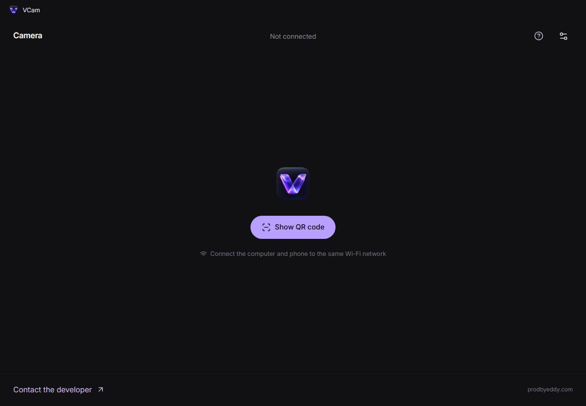

  
  <h1>VCam — your phone, your webcam</h1>
  
<strong>iPhone or Android → Windows → OBS, Zoom and other camera apps.</strong>

  
Free and open source. MIT licensed. No ads, subscriptions or watermarks. Install VCam on Windows. Use a browser on your phone.

  

    
    
  

  
<a href="README.md">Русский</a> · <a href="https://vcam.prodbyeddy.chatgpt.site/en">Website</a> · <a href="https://github.com/prodbyEDDY/vcam/releases">All releases</a> · <a href="https://vcam.prodbyeddy.chatgpt.site/en/connect">Connect phone</a>

## What VCam does

- **Turns your phone into a Windows webcam.** Select VCam in OBS, Zoom and other apps that support DirectShow cameras.
- **Connects over Wi-Fi.** Scan a QR code or enter a short code. No phone app to install.
- **Puts camera controls on your computer.** Switch available cameras, zoom, rotate, mirror, show a composition grid or pause the video.
- **Supports up to 4K and 60 FPS on compatible devices.** VCam offers modes confirmed by the camera. Focus, exposure and torch controls depend on the browser. 4K60 is not guaranteed.
- **Sends encrypted video directly between devices.** WebRTC carries the stream from phone to computer. The server helps pair them; it does not receive or store your video.
- **Speaks English and Russian.** Choose your language in Settings. The receiver keeps streaming when minimized.
- **Checks for updates once a day.** Updates download in the background and install after you close VCam. The check time is saved across restarts.

## Screenshots

**Windows:** the receiver before a phone connects. **Show QR code** creates a one-time pairing code.

Phone: QR scanner and manual code entry

Actual phone interface in Russian, shown with a test camera image in the scanner.

## Set up in four steps

1. **Install VCam** on 64-bit Windows 10 or 11. Administrator permission is needed to register the virtual camera.
2. **Put your computer and phone on the same Wi-Fi network.** Open VCam and click **Show QR code**.
3. **Scan the QR code with your phone.** Open the link in Safari on iPhone or Chrome on Android and allow camera access. You can also enter the eight-character code on the [connection page](https://vcam.prodbyeddy.chatgpt.site/en/connect).
4. **Select VCam** in your camera application's settings. Keep the phone page open and the screen unlocked.

Pairing codes are single-use and expire after ten minutes. Restart a camera application if it does not list VCam after installation.

## Before you start

- **Video only.** Use a separate microphone or your computer's microphone for audio.
- **Local network required.** Devices must be able to reach each other. Internet is needed for the website and pairing. No dedicated USB mode or TURN relay yet.
- **Windows receiver.** No macOS or Linux receiver yet. Available lenses and video quality depend on the phone, browser and network.
- **Currently in beta.** Not every device and application has been tested. The installer is not yet signed with a publisher certificate; download it from the [official releases](https://github.com/prodbyEDDY/vcam/releases).
- **Upgrading from 0.2.0 or earlier?** Install the current version manually once. Automatic updates are available from 0.2.1, with daily checks from 0.2.4.

## Open source

VCam is [MIT licensed](LICENSE). Use, inspect, modify and redistribute the code, including in commercial projects, while retaining the license and copyright notice. Third-party components keep their own licenses listed in [THIRD_PARTY_NOTICES.md](THIRD_PARTY_NOTICES.md).

[Build from source](docs/DEVELOPMENT.md) · [Architecture and hosting](docs/HOSTING.md) · [0.2.4 changes](docs/releases/0.2.4.md)

## Help and media

[iPhone setup](https://vcam.prodbyeddy.chatgpt.site/en/guides/iphone-webcam-windows) · [Android setup](https://vcam.prodbyeddy.chatgpt.site/en/guides/android-webcam-windows) · [OBS setup](https://vcam.prodbyeddy.chatgpt.site/en/guides/phone-camera-obs) · [Wi-Fi troubleshooting](https://vcam.prodbyeddy.chatgpt.site/en/guides/wifi-webcam-troubleshooting)

[Report an issue](https://github.com/prodbyEDDY/vcam/issues) · [Developer: EDDY](https://prodbyeddy.com)

Include your VCam version, phone model, browser and Windows version in bug reports. Do not post an active QR code or pairing token.

VCam covers and promotional artwork

Generated illustration. Actual application screenshots are shown above. [All six covers](docs/media/README.md) · [Asset sources and prompts](docs/IMAGEGEN.md).

VCam is an independent, free iVcam alternative. It is not affiliated with iVcam, DroidCam, Camo or Elgato.
