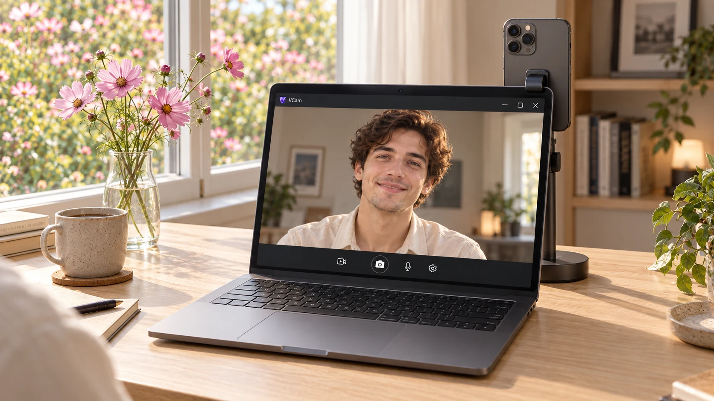
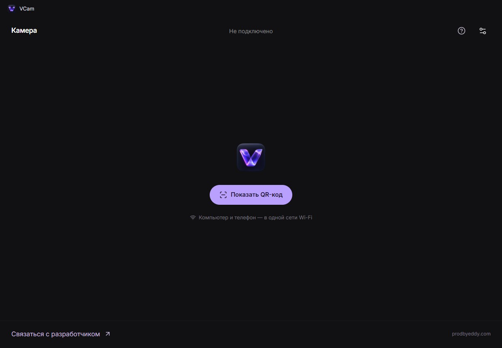
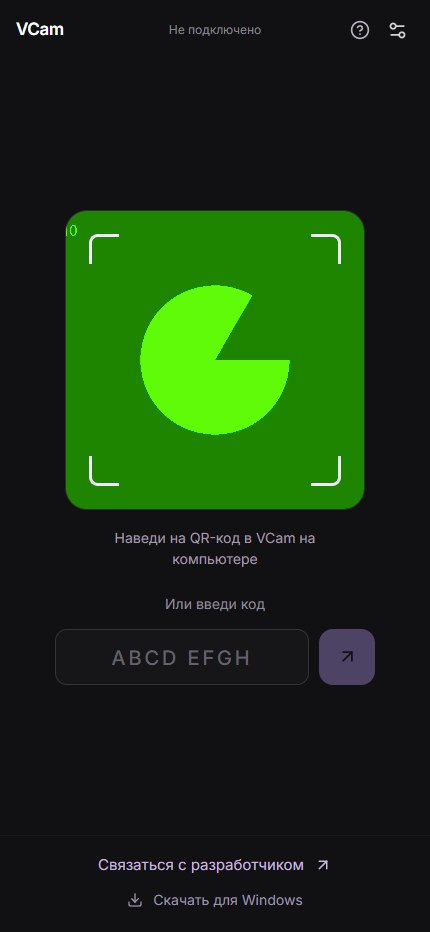
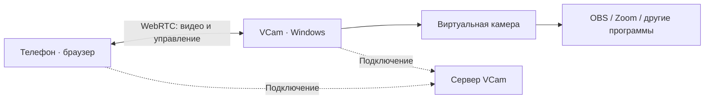

  
  <h1>VCam</h1>
  
<strong>Камера iPhone или Android для Windows</strong>

  
Бесплатная альтернатива iVcam. Без рекламы, подписки и водяного знака. Приложение нужно только на компьютере. На телефоне — браузер.

  

    
    
  

  
<a href="https://github.com/prodbyEDDY/vcam/releases/tag/v0.2.1">Что нового в 0.2.1</a> · <a href="https://vcam.prodbyeddy.chatgpt.site/connect">Сканировать QR / ввести код</a> · <a href="https://prodbyeddy.com">Связаться с разработчиком</a>

VCam создаёт виртуальную камеру Windows из видеопотока телефона. Её можно выбрать в OBS, Zoom и других программах с поддержкой DirectShow. Телефон подключается через Safari или Chrome по QR-коду либо короткому коду. Видео передаётся напрямую между устройствами по WebRTC.

**Free iVcam alternative for Windows:** use your iPhone or Android phone as a wireless webcam through its browser. No phone app, ads, subscription or watermark. This is an independent project, not affiliated with iVcam.

## Как подключиться

1. **Установи VCam на Windows.** Скачай установщик по кнопке выше. После установки открой VCam с рабочего стола или из меню «Пуск».
2. **Подключи устройства к одной сети Wi-Fi.** На компьютере нажми **«Показать QR-код»**.
3. **Открой [страницу подключения](https://vcam.prodbyeddy.chatgpt.site/connect) на телефоне.** Разреши доступ к камере и наведи её на QR в Windows-приложении. Можно также отсканировать QR обычной камерой телефона или ввести восьмисимвольный код.
4. **Выбери VCam в настройках камеры OBS, Zoom или другой программы.** Страница на телефоне должна оставаться открытой, экран — разблокированным.

QR-код и ручной код одноразовые, действуют десять минут. После считывания подключение начинается автоматически. Если программа не видит новую камеру, перезапусти её после установки VCam.

## Интерфейс

### Windows

В главном окне — создание QR, предпросмотр и управление камерой. Приложение можно свернуть: передача видео продолжается.

### Телефон

На странице подключения — видоискатель для QR и поле ручного ввода. Камера сканера освобождается перед началом трансляции.

*Скриншот страницы с тестовой камерой. Изображение в начале README — сгенерированный мокап, а не снимок работающего приложения.*

## Возможности

| Функция | Как работает |
| --- | --- |
| Виртуальная камера | Доступна программам Windows с поддержкой DirectShow. В установщике есть компоненты для 32- и 64-битных программ. |
| Камеры и объективы | Можно переключать переднюю, заднюю и другие камеры, которые предоставляет браузер телефона. |
| Качество | Проверяются 720p30, 1080p30/60 и 4K30/60. Предлагаются только подтверждённые камерой режимы. |
| Управление с компьютера | Зум, поворот, отражение, сетка и пауза. Дополнительные настройки фокуса, экспозиции и фонарика — если доступны в браузере. |
| Параметры потока | В настройках видны фактические разрешение, частота кадров и скорость передачи. |
| Автообновления | Начиная с 0.2.1, проверка GitHub Releases после запуска и каждый час, пока VCam открыт. Загрузка в фоне, установка после закрытия приложения. |
| Стоимость | Все функции бесплатны. Нет рекламы, подписки, водяного знака и программного лимита длительности трансляции. |

**4K и 60 кадров/с зависят от телефона, браузера, сети и компьютера. Работа в 4K60 не гарантируется.** Safari может предоставлять меньше настроек и объективов, чем штатное приложение камеры iPhone.

## Как передаётся видео

- **Видео не проходит через сервер VCam и не сохраняется на нём.** Сервер раздаёт сайт и помогает устройствам установить прямое соединение.
- QR содержит случайный ключ в адресном фрагменте. Сервер хранит хеши ключей и кодов; повторное использование блокируется, число попыток ввода ограничено.
- После соединения обмен через сервер прекращается. Управление камерой идёт по WebRTC DataChannel.
- Нагрузка на сервер зависит от посещений сайта и подключений. Длительность прямого видеопотока не создаёт видеотрафик на сервере. Подробнее: [нагрузка и хостинг](docs/HOSTING.md).

## Требования и ограничения beta

- **Компьютер:** Windows 10/11 x64. Для установки камеры нужны права администратора.
- **Телефон:** iPhone с Safari или Android с Chrome; доступ к камере по HTTPS. Совместимость со всеми устройствами пока не проверена, в том числе эта сборка не испытана на физическом iPhone 14 Pro Max.
- **Сеть:** доступ к интернету для сайта и подключения; одна локальная сеть без изоляции клиентов. TURN-ретранслятора в текущей версии нет.
- **Фоновая работа:** Windows-приложение сворачивать можно. На телефоне держи страницу открытой и экран разблокированным.
- **Звук:** пока не передаётся. Используй отдельный микрофон или микрофон компьютера.
- **Установщик:** пока без сертификата издателя, поэтому Windows может показать предупреждение. Загружай установку только из [официальных релизов](https://github.com/prodbyEDDY/vcam/releases).
- **Обновление с 0.2.0 и ниже:** установи 0.2.1 вручную один раз. В старых версиях нет механизма автоматического обновления. Следующие версии будут загружаться автоматически; Windows может запросить права администратора для установки.

## Разработка и документация

- [Сборка на Windows, архитектура и проверки](docs/DEVELOPMENT.md)
- [Изменения и ограничения текущего выпуска](docs/RELEASE.md)
- [Нагрузка на сервер](docs/HOSTING.md)
- [Источники изображений и промпты ImageGen](docs/IMAGEGEN.md)
- [Лицензии сторонних компонентов](THIRD_PARTY_NOTICES.md)

React / Vinext · Electron · WebRTC · C++ / DirectShow · Cloudflare Workers / D1

## Обратная связь

[Сообщить об ошибке](https://github.com/prodbyEDDY/vcam/issues) или [написать разработчику](https://prodbyeddy.com). Для ошибки подключения укажи версию VCam, модель телефона, браузер и версию Windows. Не публикуй действующий QR-код или код подключения.

Если VCam пригодился, можно поставить звезду на GitHub. Приложение доступно бесплатно независимо от этого.
