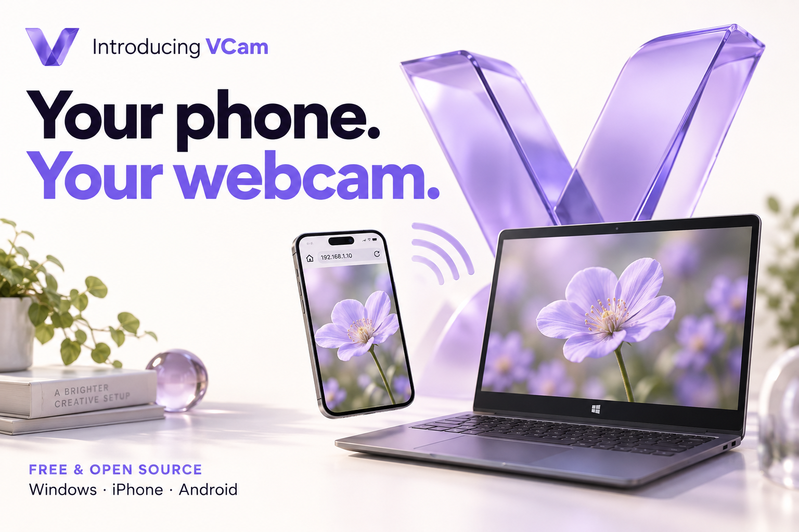
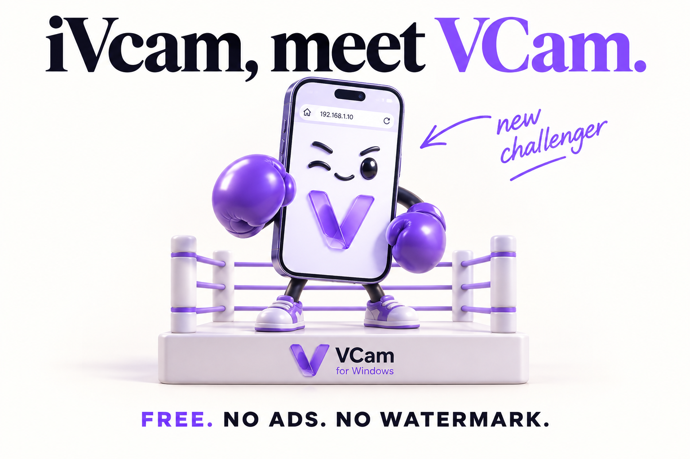
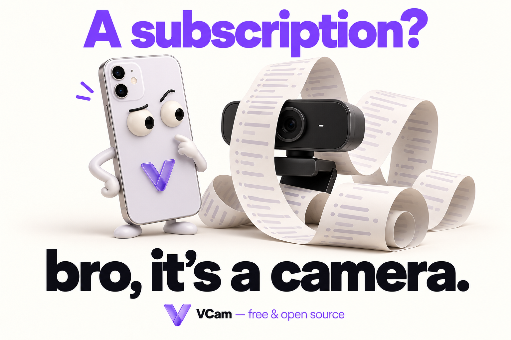
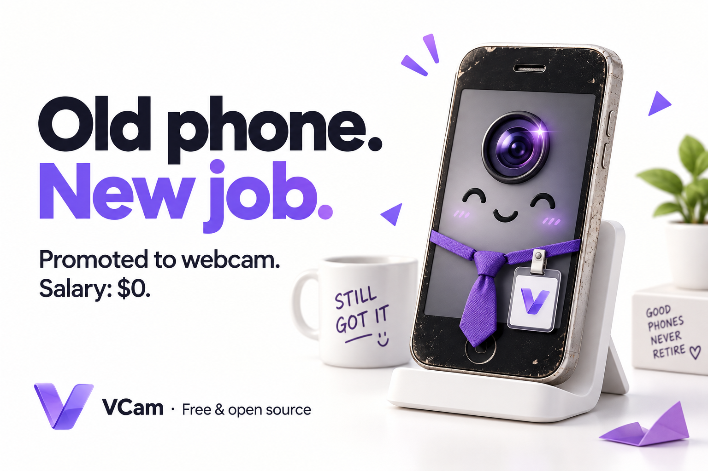
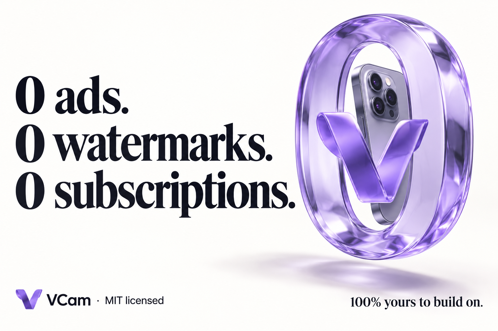
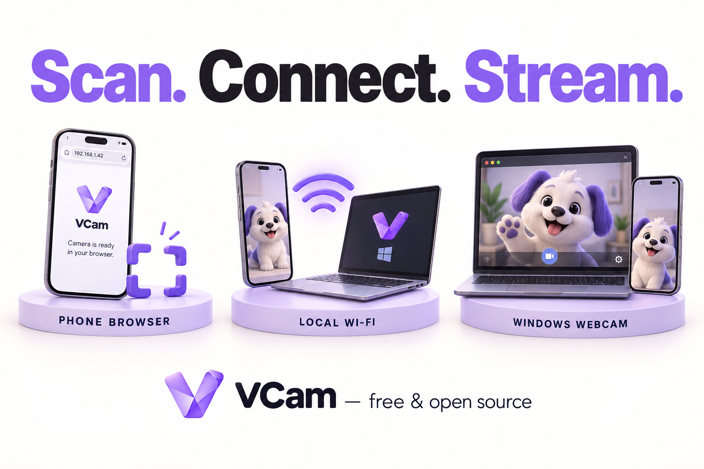

# VCam launch artwork

Six promotional illustrations on light backgrounds. These are generated artwork, not application screenshots. Real Windows and phone screenshots are in [../screenshots](../screenshots).

## 1. Introducing VCam

## 2. iVcam, meet VCam

## 3. A subscription?

## 4. Old phone. New job.

## 5. Zero ads, watermarks or subscriptions

## 6. Scan. Connect. Stream.

Generated with OpenAI ImageGen. [Exact prompts](prompts.json). VCam is an independent project and is not affiliated with iVcam.

